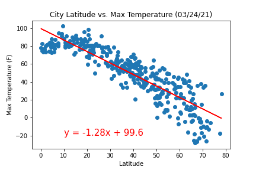
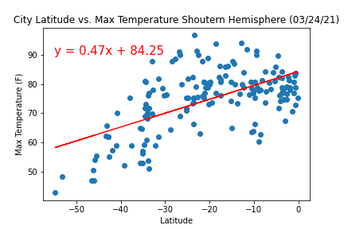
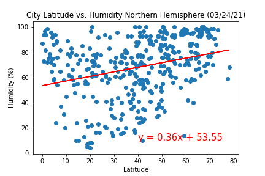
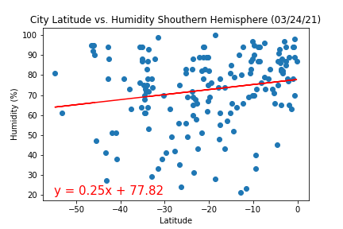
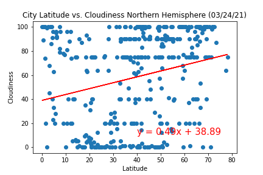
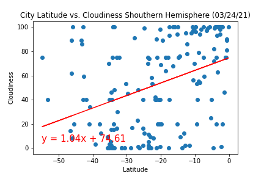
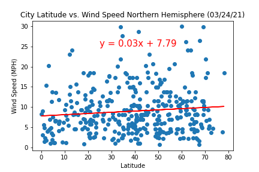
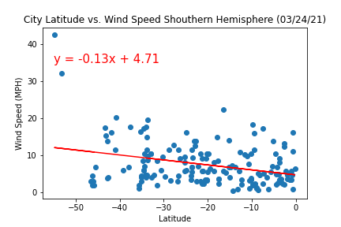
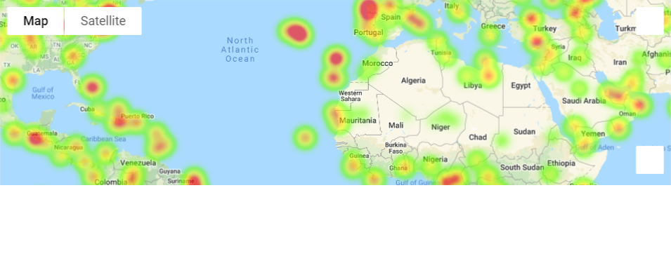
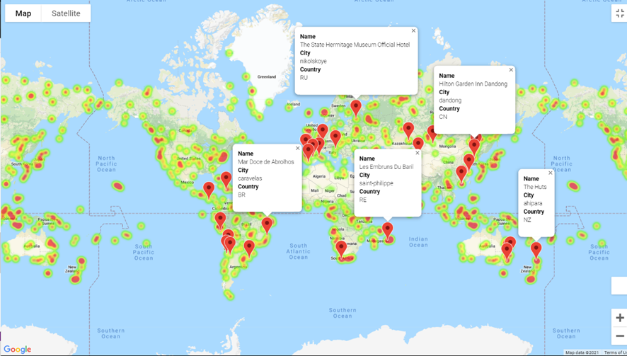

# Python-Api-Challange-JDAP

## Python API Homework - What's the Weather Like?

### Intention of the Repository

This Repository has been made to summit the homework assignment for my Data Science Bootcamp at Northwestern University

Python API

Student: Jorge Daniel Atuesta

March, 2021

---

### Inside of this repository

In this repository, the reader will encounter my solution to the homework assignment Python API. The repository is organized in folders and a README.md (The file you are currently reading). Here is the list of the folders and their contents so you can navigate through them.

I hope you find my work not only to be complete but to display all the knowledge learned throughout this portion of the Data Science Bootcamp at Northwestern University.1. **WeatherPy:** Inside this folder, you will have the chance to access my code for the assignment and all the output data. I encourage you to take a look inside as you will find the solution to the project and screenshots from it. Here are what's inside:

   * output_data: All images and csv files created for the project.
   * Heatmap.png: an image of the heatmap I created using Google API.
   * Heatmap_with_hotels: an image of the heatmap I created with reference points I created using Google API.
   * VacationPy-with-outputs: Here is my code for the vacation portion of the project.
   * WeatherPy-updated: Here is my code for the weather portion of the project.
2. **README.md**: it's the current file you are reading. I strongly suggest navigating through it and look at the project's objective solution and analysis.

I hope you find my work not only to be complete but to display all the knowledge learned throughout this portion of the Data Science Bootcamp at Northwestern University.

---

## Python API Project

### Project's Aim

using Python requests, APIs, and JSON traversals to answer a fundamental question: "What's the weather like as we approach the equator?

#### Project's Challanges

There are two parts to this project. The first one is denominated WeatherPy, for this portion I had to create scatterplots showcasing the following relationships:

* Temperature (F) vs. Latitude
* Humidity (%) vs. Latitude
* Cloudiness (%) vs. Latitude
* Wind Speed (mph) vs. Latitude

After creating this scatterplots I had to run linear regression on each relationship, only this time separating them into Northern Hemisphere and Southern Hemisphere (

* Northern Hemisphere - Temperature (F) vs. Latitude
* Southern Hemisphere - Temperature (F) vs. Latitude
* Northern Hemisphere - Humidity (%) vs. Latitude
* Southern Hemisphere - Humidity (%) vs. Latitude
* Northern Hemisphere - Cloudiness (%) vs. Latitude
* Southern Hemisphere - Cloudiness (%) vs. Latitude
* Northern Hemisphere - Wind Speed (mph) vs. Latitude
* Southern Hemisphere - Wind Speed (mph) vs. Latitude

The second portion of the project is denominated VacationPy. For this portion I had to use jupyter-gmaps and the Google Places API to search for 'my ideal' vacation spot. For this I created a heat map that displays the humidity for every city (on part 1). After this I used Google Places API to find the first hotel for each city located within 5000 meters of the designated coordinates. Last but not least I plotted the hotels on top of the humidity heatmap with each pin containing the **Hotel Name**, **City**, and **Country**.

---

### Project outcomes

#### WeatherPy

**Temperature (F) vs. Latitude**

**Humidity (%) vs. Latitude**

**Cloudiness (%) vs. Latitude**

**Wind Speed (mph) vs. Latitude**

**Northern Hemisphere - Temperature (F) vs. Latitude**

**Southern Hemisphere - Temperature (F) vs. Latitude**

**Northern Hemisphere - Humidity (%) vs. Latitude**

**Southern Hemisphere - Humidity (%) vs. Latitude**

**Northern Hemisphere - Cloudiness (%) vs. Latitude**

**Southern Hemisphere - Cloudiness (%) vs. Latitude**

**Northern Hemisphere - Wind Speed (mph) vs. Latitude**

**Southern Hemisphere - Wind Speed (mph) vs. Latitude**

#### VacationPy

Here is an image of the heatmap I created before putting the hotels on it. 

Here is an image of the heatmap I created with the hotels. The image size is small but you can get a sense of the final product. 

## References

Frost, J. (2018, April 3). Interpreting Correlation Coefficients. Retrieved from Statistics By Jim :
https://statisticsbyjim.com/basics/correlations/#:~:text=As%20one%20value%20increases%2 %20there,0.6%3A%20A%20moderate%20negative%20relationship.

Littel, T. (2021, March 24). Tutoring session March 24th 2021. (J. D. Atuesta, Interviewer)

Mr.T. (2018, June 5). Matplotlib - Border around scatter plot points. Retrieved from Stack Overflow: https://stackoverflow.com/questions/50706901/matplotlib-border-around-scatter plot-points

**Please note: I am new to .md files and I cant seem to indent the reference following the APA guidelines**

## Assignment instructions provided by Northwestern Data Science Bootcamp

### Python API Homework - What's the Weather Like?

#### Background

Whether financial, political, or social -- data's true power lies in its ability to answer questions definitively. So let's take what you've learned about Python requests, APIs, and JSON traversals to answer a fundamental question: "What's the weather like as we approach the equator?"

Now, we know what you may be thinking: _"Duh. It gets hotter..."_

But, if pressed, how would you **prove** it?

#### Before You Begin

1. Create a new repository for this project called `python-api-challenge`. **Do not add this homework to an existing repository**.
2. Clone the new repository to your computer.
3. Inside your local git repository, create a directory for both of the  Python Challenges. Use folder names corresponding to the challenges: **WeatherPy**.
4. Inside the folder that you just created, add new files called `WeatherPy.ipynb` and `VacationPy.ipynb`. These will be the main scripts to run for each analysis.
5. Push the above changes to GitHub.

### Part I - WeatherPy

In this example, you'll be creating a Python script to visualize the weather of 500+ cities across the world of varying distance from the equator. To accomplish this, you'll be utilizing a [simple Python library](https://pypi.python.org/pypi/citipy), the [OpenWeatherMap API](https://openweathermap.org/api), and a little common sense to create a representative model of weather across world cities.

Your first requirement is to create a series of scatter plots to showcase the following relationships:

* Temperature (F) vs. Latitude
* Humidity (%) vs. Latitude
* Cloudiness (%) vs. Latitude
* Wind Speed (mph) vs. Latitude

After each plot add a sentence or too explaining what the code is and analyzing.

Your second requirement is to run linear regression on each relationship, only this time separating them into Northern Hemisphere (greater than or equal to 0 degrees latitude) and Southern Hemisphere (less than 0 degrees latitude):

* Northern Hemisphere - Temperature (F) vs. Latitude
* Southern Hemisphere - Temperature (F) vs. Latitude
* Northern Hemisphere - Humidity (%) vs. Latitude
* Southern Hemisphere - Humidity (%) vs. Latitude
* Northern Hemisphere - Cloudiness (%) vs. Latitude
* Southern Hemisphere - Cloudiness (%) vs. Latitude
* Northern Hemisphere - Wind Speed (mph) vs. Latitude
* Southern Hemisphere - Wind Speed (mph) vs. Latitude

After each pair of plots explain what the linear regression is modeling such as any relationships you notice and any other analysis you may have.

Your final notebook must:

* Randomly select **at least** 500 unique (non-repeat) cities based on latitude and longitude.
* Perform a weather check on each of the cities using a series of successive API calls.
* Include a print log of each city as it's being processed with the city number and city name.
* Save a CSV of all retrieved data and a PNG image for each scatter plot.

#### Part II - VacationPy

Now let's use your skills in working with weather data to plan future vacations. Use jupyter-gmaps and the Google Places API for this part of the assignment.

* **Note:** Remember that any API usage beyond the $200 credit will be charged to your personal account. You can set quotas and limits to your daily requests to be sure you can't be charged. Check out [Google Maps Platform Billing](https://developers.google.com/maps/billing/gmp-billing#monitor-and-restrict-consumption) and [Manage your cost of use](https://developers.google.com/maps/documentation/javascript/usage-and-billing#set-caps) for more information.
* **Note:** if you having trouble displaying the maps try running `jupyter nbextension enable --py gmaps` in your environment and retry.
* Create a heat map that displays the humidity for every city from the part I of the homework.

  
* Narrow down the DataFrame to find your ideal weather condition. For example:

  * A max temperature lower than 80 degrees but higher than 70.
  * Wind speed less than 10 mph.
  * Zero cloudiness.
  * Drop any rows that don't contain all three conditions. You want to be sure the weather is ideal.
  * **Note:** Feel free to adjust to your specifications but be sure to limit the number of rows returned by your API requests to a reasonable number.
* Using Google Places API to find the first hotel for each city located within 5000 meters of your coordinates.
* Plot the hotels on top of the humidity heatmap with each pin containing the **Hotel Name**, **City**, and **Country**.

  

As final considerations:

* Create a new GitHub repository for this project called `API-Challenge` (note the kebab-case). **Do not add to an existing repo**
* You must complete your analysis using a Jupyter notebook.
* You must use the Matplotlib or Pandas plotting libraries.
* For Part I, you must include a written description of three observable trends based on the data.
* For Part II, you must include a screenshot of the heatmap you create and include it in your submission.
* You must use proper labeling of your plots, including aspects like: Plot Titles (with date of analysis) and Axes Labels.
* For max intensity in the heat map, try setting it to the highest humidity found in the data set.

### Hints and Considerations

* The city data you generate is based on random coordinates as well as different query times; as such, your outputs will not be an exact match to the provided starter notebook.
* You may want to start this assignment by refreshing yourself on the [geographic coordinate system](http://desktop.arcgis.com/en/arcmap/10.3/guide-books/map-projections/about-geographic-coordinate-systems.htm).
* Next, spend the requisite time necessary to study the OpenWeatherMap API. Based on your initial study, you should be able to answer  basic questions about the API: Where do you request the API key? Which Weather API in particular will you need? What URL endpoints does it expect? What JSON structure does it respond with? Before you write a line of code, you should be aiming to have a crystal clear understanding of your intended outcome.
* A starter code for Citipy has been provided. However, if you're craving an extra challenge, push yourself to learn how it works: [citipy Python library](https://pypi.python.org/pypi/citipy). Before you try to incorporate the library into your analysis, start by creating simple test cases outside your main script to confirm that you are using it correctly. Too often, when introduced to a new library, students get bogged down by the most minor of errors -- spending hours investigating their entire code -- when, in fact, a simple and focused test would have shown their basic utilization of the library was wrong from the start. Don't let this be you!
* Part of our expectation in this challenge is that you will use critical thinking skills to understand how and why we're recommending the tools we are. What is Citipy for? Why would you use it in conjunction with the OpenWeatherMap API? How would you do so?
* In building your script, pay attention to the cities you are using in your query pool. Are you getting coverage of the full gamut of latitudes and longitudes? Or are you simply choosing 500 cities concentrated in one region of the world? Even if you were a geographic genius, simply rattling 500 cities based on your human selection would create a biased dataset. Be thinking of how you should counter this. (Hint: Consider the full range of latitudes).
* Once you have computed the linear regression for one chart, the process will be similar for all others. As a bonus, try to create a function that will create these charts based on different parameters.
* Remember that each coordinate will trigger a separate call to the Google API. If you're creating your own criteria to plan your vacation, try to reduce the results in your DataFrame to 10 or fewer cities.
* Lastly, remember -- this is a challenging activity. Push yourself! If you complete this task, then you can safely say that you've gained a strong mastery of the core foundations of data analytics and it will only go better from here. Good luck!
* Ensure your repository has regular commits (i.e. 20+ commits) and a thorough README.md file

### Copyright

Trilogy Education Services © 2019. All Rights Reserved.
